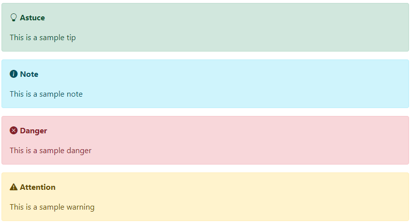

# Markdig.Extensions.Bootstrap.Admonition

This is an extension for Markdig to add admonitions (also known as **call-outs**).




## Initialization

You can instanciate ```BootstrapAdmonitionExtension``` in two ways.

The first, and the simplest way: 
```csharp
new BootstrapAdmonitionExtension("Warning", "Danger", "Tips", "Notes")
```

We only have to specify the titles for the **four** admonitions configured by default.

The second allows us to create our own types of admonitions:  :
```csharp
new BootstrapAdmonitionExtension(new List<BootstrapAdmonitionTemplate>()
{
    new BootstrapAdmonitionTemplate("tip", "success", "lightbuld", "Tip"),
    new BootstrapAdmonitionTemplate("note", "info", "info-circle-fill", "Notes"),
    ...
}
```
To instanciate ```BootstrapAdmonitionTemplate```, we have to provide 4 aguments: 
1. The **key name** of the admonition
2. The name of the bootstrap alert type. See the [bootstrap documentation](https://getbootstrap.com/docs/5.0/components/alerts/)
3. The name of the bootstrap icon. See the [bootstrap documentation](https://icons.getbootstrap.com/)
4. The title of the admonition, as it will appear in the rendering.

## How to use

In your markdown document we will use the following syntax specifying the key name of the admonition we want to use (case insensitive). : 

```markdown
::: warning
This is a sample warning 
:::
```


